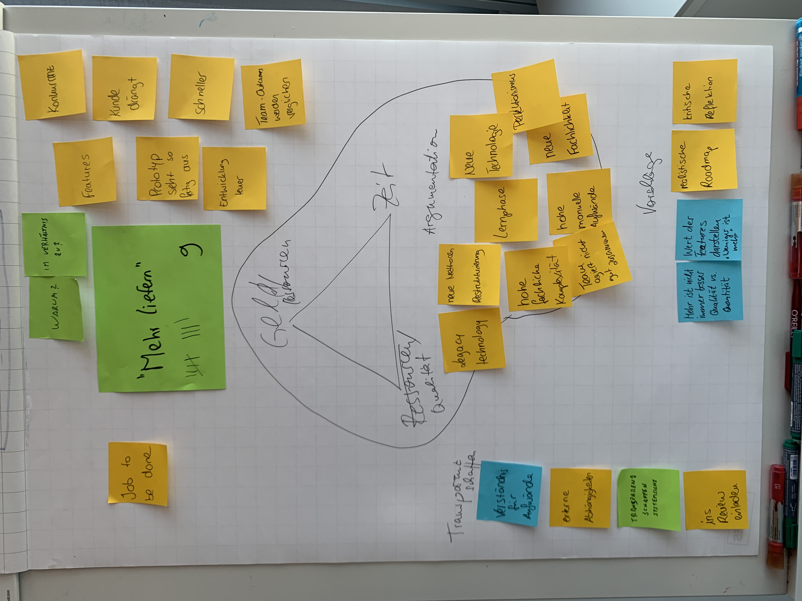

# Twice the work in half the time

Was für ein verführerischer Buchtitel, den Jeff Sutherland uns da präsentiert hatte, oder?

Doch die Trauer unter uns Product Ownern & Product People ist sehr groß. Denn wir haben es häufig mit Management zu tun, die natürlich wenig Einblick darin haben, wie Softwareentwicklung denn wirklich funktioniert.

Trotzdem schallt uns diese Forderung immer wieder entgegen. Mit dieser Session habe ich Euch dazu eingeladen, über die typischen Forderungen aus den vom Produktentwicklungsteam entfernteren Organisations-Ebenen (Management, Marketing, Vertrieb und andere) zu reflektieren und Lösungsideen zu formulieren.

Was soll ich sagen: In drei Arbeitsgruppen konnten wir innerhalb der Session Timebox super Ergebnisse erreichen. Diese findet Ihr hier in den Impressionen wieder.

Falls Ihr weitere Fragen, weitere Ideen oder Anmerkungen habt, so freue ich mich über eine Nachricht an bjoern.schotte@mayflower.de

## Wie war das Vorgehen in der Session?

Zunächst haben wir in einem Brainwriting auf PostIts aufgeschrieben, welcher Forderungen / Herausforderungen auf Euch im Kontext von „Twice the work in half the time“ zukommen.

Diese haben wir dann über ein Dot Voting priorisiert. Für die Top3 Punkte wurden einzelne Arbeitsgruppen gebildet, in denen an einzelnen Stationen Lösungswege erarbeitet wurden.

Zum Ende der Session hat jede Arbeitsgruppe die gefundenen Ideen & Impulse allen anderen vorgestellt.

## Themenspeicher / Agenda

Hier waren die Punkte, die wir nicht behandeln konnten.

## Arbeitsgruppe: Ignorieren von Prioritäten

## Arbeitsgruppe: Mehr liefern

## Arbeitsgruppe: Das Nachbarteam macht etwas ähnliches, wollt Ihr nicht Synergien schaffen?

